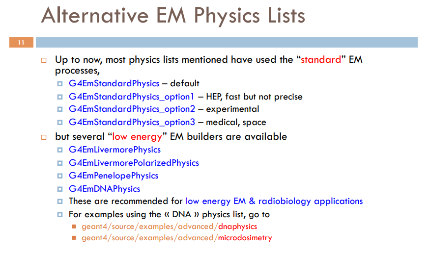

# Introduction

This is a personal note for learning Monte Carlo software [GATE](https://github.com/OpenGATE/Gate). The official document is [here](https://opengate.readthedocs.io/en/latest/). I found that the official document is somehow outdated, and some parts are not very clear (e.g. the visualization in 'Getting Started' section). This personal note is a complementary of official document. For some basic and detailed description, you still need to refer to the [official document](https://opengate.readthedocs.io/en/latest/).


# Visualization

## Open window and show geometry

In the [Getting Started](https://opengate.readthedocs.io/en/latest/getting_started.html) section, it is not clear how to visualize the geometry. Here is how to do it.

First you need to open a window:

`
/vis/open OGL
`

Then you should run

`
/vis/drawVolume
`

to enable showing object. The default view angle is not good. It is recommended to change it to a different angle, for example:

`
/vis/viewer/set/viewpointThetaPhi 45 45
`

GATE does not automatically update visualization. You need to type 

`
/gate/geometry/rebuild
`

to let it update your geometry. In my test, it is not needed to type `/gate/run/initialize` to let it show the geometry, though this command is necessary for running the complete simulation.


## Change view point

There are two ways to zoom in or zoom out the view. The first way is to zoom based on current view. For example,

`
/vis/viewer/zoom 2
`

will zoom in by a factor of 2. If the number is smaller than 1, it will zoom out with the given factor.

Another method is to zoom based on default view. The syntax is

`
/vis/viewer/zoomTo 2
`

This will zoom in based on the default view. You can take *relative path* and *absolute path* as an analogy. Without doubt, the following command will set zoom to default.

`
/vis/viewer/zoomTo 1
`

The command to translate viewer window is `pan` and `panTo`. For example

`
/vis/viewer/pan 0.5 0 
`

`
/vis/viewer/panTo 20 -40 mm
`

In my test, if unit is not specified, the default unit seems to be *meter*. Correct me if this is wrong.

## Render style

To render a volume (e.g. phantom) in solid style instead of wire frame style, the following command can be used:

`
/gate/my_phantom/vis/forceSolid
`

# System

System is a key-concept of GATE which provides a template of a predefined geometry to simulate a scanner. The document is [here](https://opengate.readthedocs.io/en/latest/defining_a_system_scanner_ct_pet_spect_optical.html#defining-a-system-label).

In section [Step 1: Defining a scanner geometry](https://opengate.readthedocs.io/en/latest/getting_started.html#step-1-defining-a-scanner-geometry) of [Getting Started](https://opengate.readthedocs.io/en/latest/getting_started.html) part, it says that volumes should be attached to a sensitive detector in order to save the *hits*, and gives the following example:

```
# D E F I N E   A   S E N S I T I V E   D E T E C T O R
/gate/box2/attachCrystalSD vglue 1cm
```

where the argument `vglue 1cm` is very confusing. I checked the email [archive](http://lists.opengatecollaboration.org/pipermail/gate-users/2012-July/005835.html), and found that `vglue 1cm` seems to be a typo. In other words, there should be no `vglue 1cm`. The correct command should be 

`
/gate/box2/attachCrystalSD
`

The discussion in email [archive](http://lists.opengatecollaboration.org/pipermail/gate-users/2012-July/005835.html) is based on old version GATE v6.1, but I think it is still applicable to current version (v9.2).


# Physics

## Physics list

GATE recommends "physics list builder" mechanism starting from Version 7.0. A short (and old) introduction is [here](http://geant4.in2p3.fr/IMG/pdf_PhysicsLists.pdf). For X-ray imaging application, I think the best option is `emstandard_opt3`? This is how to add the physics list in GATE:

`
/gate/physics/addPhysicsList emstandard_opt3
`



## Cut

The [document](https://opengate.readthedocs.io/en/latest/cut_and_variance_reduction_technics.html#production-threshold) says the list of production threshold can be displayed with the command:

`
/gate/physics/displayCuts
`

However, in my test, it does not display anything. Why? In addition, it says this command should be used after the initialization. Again, I found other examples use this command **before** initialization.

# Digitizer

This part seems to be very complicated ...

# Source

There is a command `gps` in GATE, which is not described. According to [GEANT4 document](https://geant4-userdoc.web.cern.ch/UsersGuides/ForApplicationDeveloper/html/GettingStarted/generalParticleSource.html), `gps` should mean **General Particle Source**. In addition, some commands related to `gps` are deprecated, for example,

`
/gate/source/twogamma/gps/centre 0 0 0 cm
`

is shown to be deprecated, where `twogamma` is the source name defined by users. It seems that it should be replaced with

`
/gate/source/twogamma/gps/pos/centre 0 0 0 cm
`

which is shown (in Qt window) that it has the same effect as 

`
/gate/source/twogamma/gps/position 0 0 0 cm
`

(Pretty confusing!) So I recommend checking the message in Qt window, which can be opened with command

`
Gate --qt
`

# Data output
